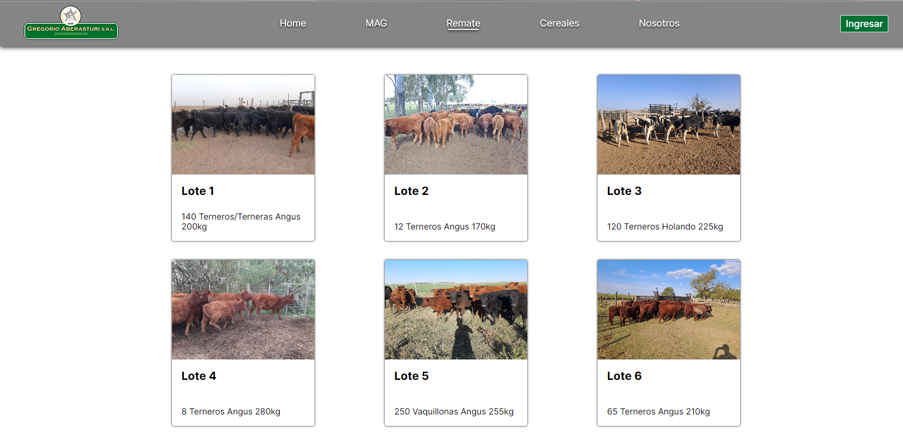
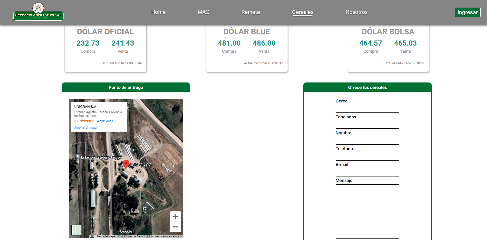
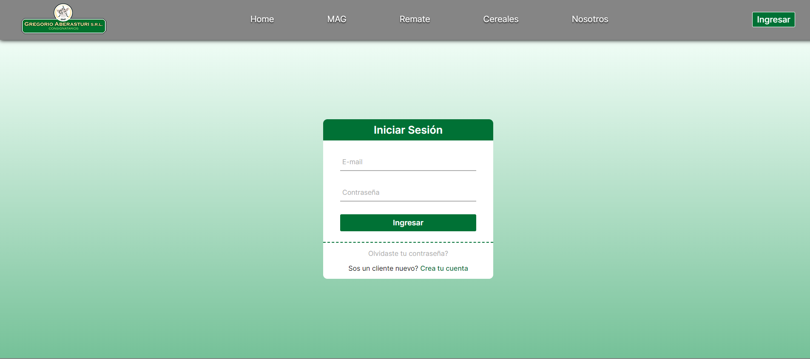

# Gregorio Aberasturi SRL | Consignataria

> Este proyecto es un sitio web prototipo para una consignataria de ganado vacuno y acopiadora de cereales.

## Tecnologías usadas
- HTML
- CSS
- SASS
- JAVASCRIPT

## Contenidos

### Catálogo de lotes de hacienda

> Previsualización de como seria un catálogo de lotes de hacienda. Para entrar a comprar, la pagina nos redirecciona a la de Log In ya que es necesario relacionar la compra con un usuario.

### Apartado para cereales

> Utilizando Iframes la pagina muestra diferentes cotizaciones del dolar para información del agricultor, quien las necesita para la toma de decisiones. 

> Tambien utilizando un Iframe se muestra la localización de la planta de silos de la empresa para la carga y descarga de granos, para los clientes interesados en el acopio.

> Además se añade un formulario para que cliente pueda ofrecer sus granos desde la página.

### Página de incio de sesión

> Página de inicio de sesion para que toda la actividad del cliente pueda ser relacionada con su usuario.